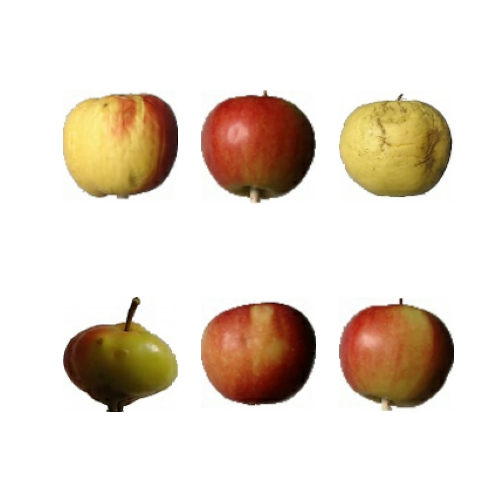
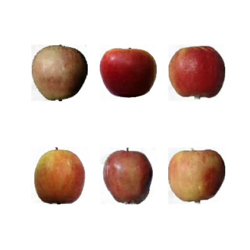
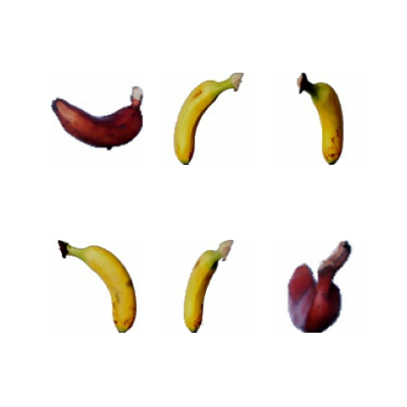
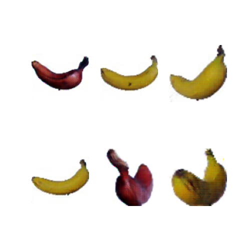
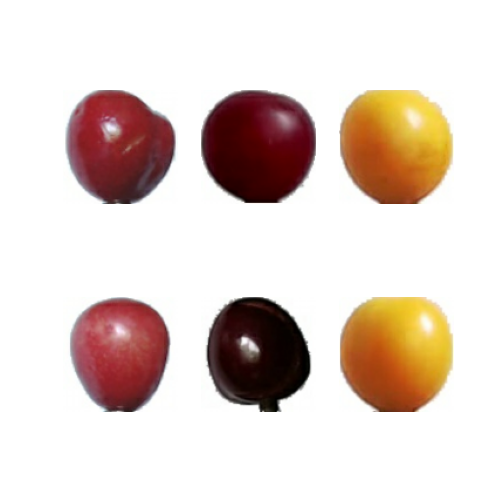
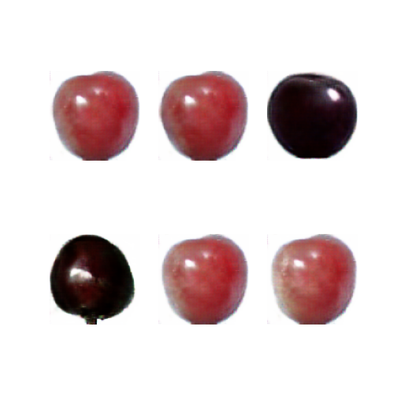
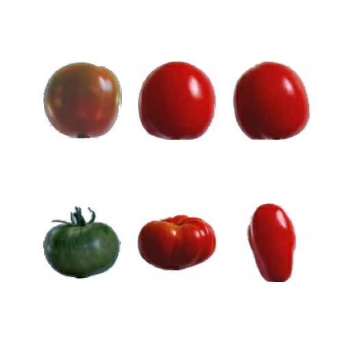
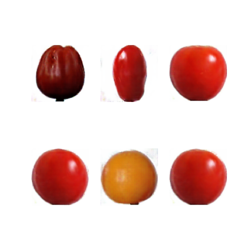
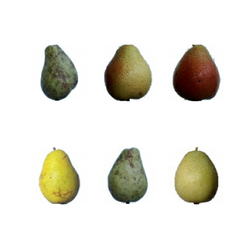
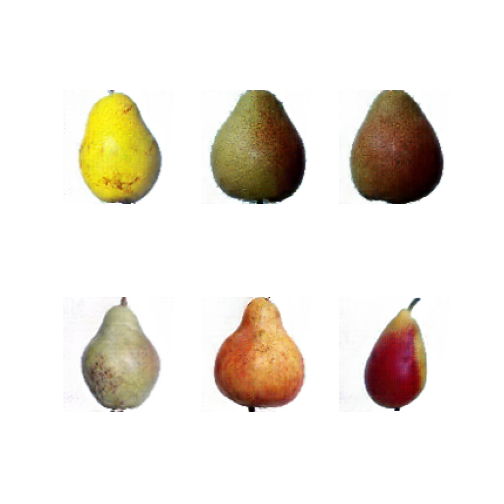

# Fruit GAN

Original Apple             |  GAN Apple
:-------------------------:|:-------------------------:
|  

Original Banana             |  GAN Banana
:-------------------------:|:-------------------------:
|  

Original Cherry             |  GAN Cherry
:-------------------------:|:-------------------------:
|  

Original Tomato             |  GAN Tomato
:-------------------------:|:-------------------------:
|  

Original Pear             |  GAN Pear
:-------------------------:|:-------------------------:
|  

## Colab Notebook Example
[Colab: Fruit GAN Notebook Example](https://colab.research.google.com/drive/1Ud0iQ8fSzxLqrSlckpdbtbDBpOpuAJsB#scrollTo=RrS86FMCC2cO) 

## Current Pretrained Models 
Custom DCGAN + Augmentation
| Pretrained Models | Dataset |
| --- | --- | 
| `Apple.h5` | `Fruits 360` | 
| `Banana.h5` | `Fruits 360` | 
| `Cherry.h5` | `Fruits 360` | 
| `Pear.h5` | `Fruits 360` | 
| `Tomato.h5` | `Fruits 360` | 

  
